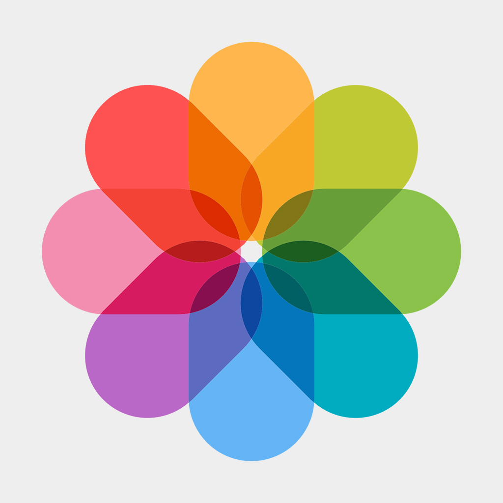
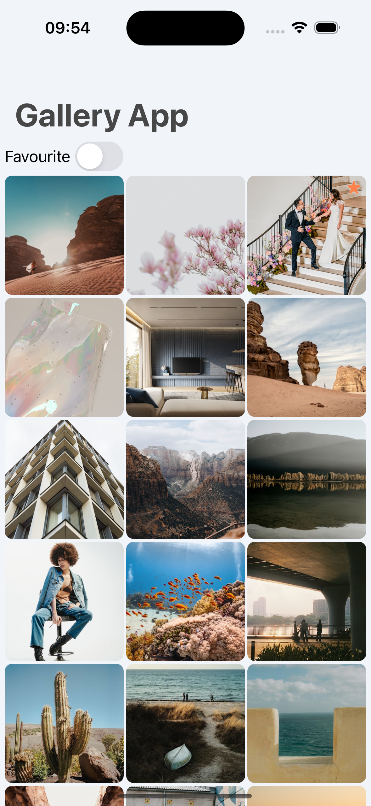
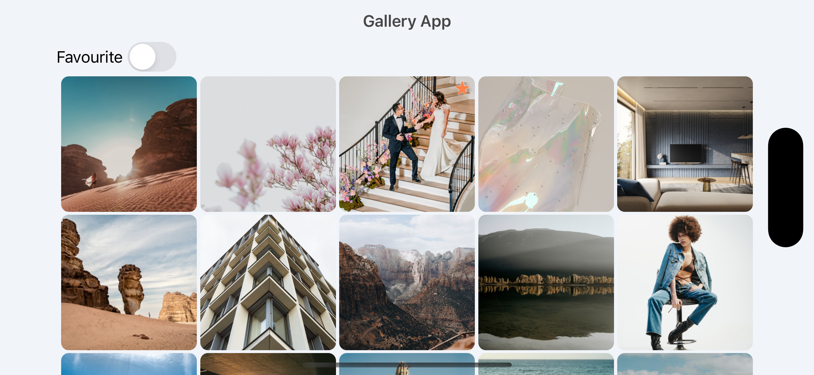
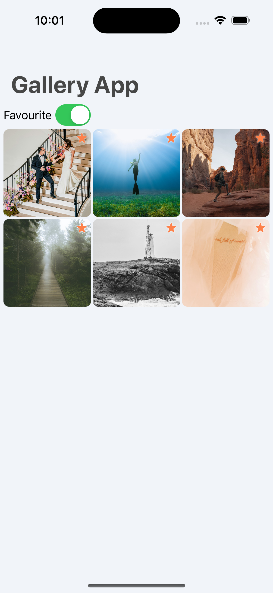
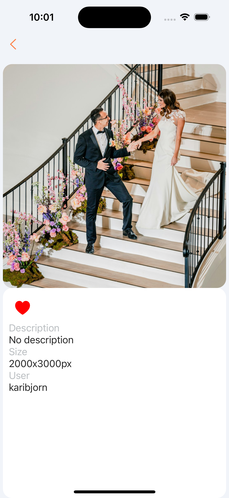

<!-- PROJECT LOGO -->
 

    
  <h3 align="center">Gallery App README</h3>

<!-- TABLE OF CONTENTS -->

    
  
Table of Contents

  <ol>
    <li>
      <a href="#about-the-project">About The Project</a>
      <ul>
        <li><a href="#built-with">Built With</a></li>
      </ul>
    </li>
    <li><a href="#contact">Contact</a></li>
  </ol>

## About The Project

<a href="https://www.youtube.com/shorts/-sUoameFA_s" target="_blank">Youtube preview</a>
        

| Main Screen | Main Screen Landscape | Favourites Screen | Details Screen |
| --- | --- | --- | --- |
|  |  |  |  |

 

An iOS app that shows images from Unsplash API.

(<a href="#readme-top">back to top</a>)

## Built With

This app was build using MVVM-C architecture. Frameworks were integrated with Cocoa Pods. To install use pod install.

 
<ul>
    <li>UIKit</li>
    <li>SnapKit</li>
    <li>Combine</li>
    <li>URLSession</li>
    <li>Realm</li>
    <li>SDWebImage</li>
    <li>Caching</li>
    <li>Dependency Injection</li>
    <li>XCode Instruments</li>
</ul>

URLSession was used for getting and then parsing data with JSONDecoder from Unsplash API, Realm for storing favourite images locally. SDWebImage was used for geting images by passing url to it and cache images for later use. All UI was created with UIKit and SnapKit for constraints

## Contact
My [LinkedIn](https://www.linkedin.com/in/nicktsaruk/)
